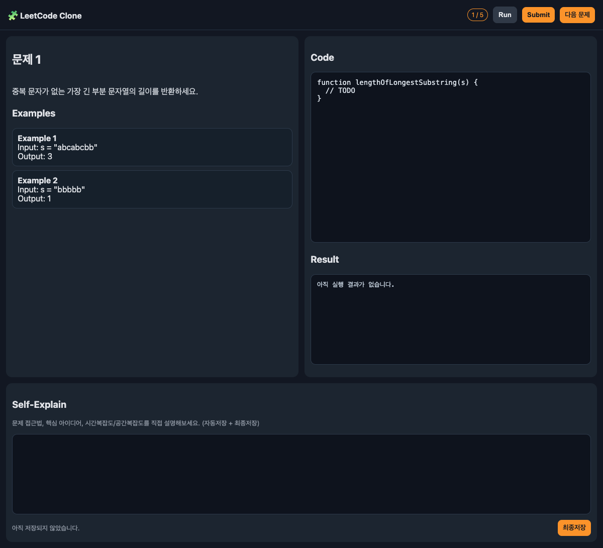
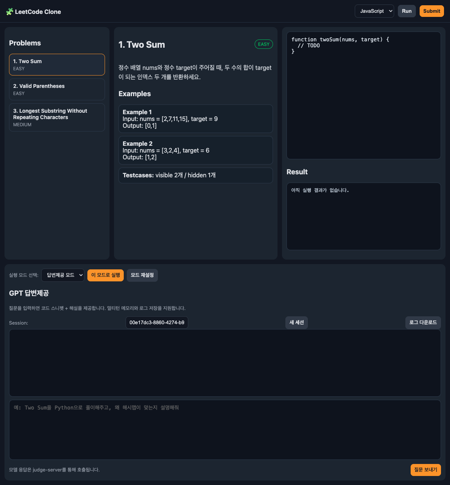
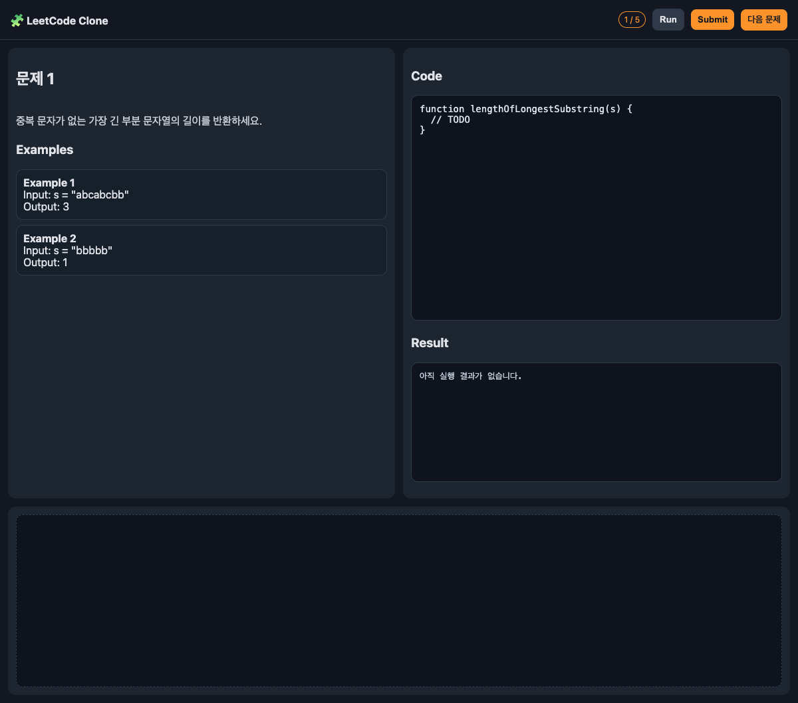

# LeetCode Clone + FastAPI Judge Server

현재 버전은 **실행 인자 기반 고정 실행 모델**입니다.

- UI에서 문제세트/모드를 선택하지 않습니다.
- 실행 시 URL args로 `set`, `mode`, `user_id`를 전달합니다.
- UI 조작은 **Run / Submit / 다음 문제**만 가능합니다.
- **이전 문제로 돌아갈 수 없습니다.**

---

## 실행 화면 (최신)

### 메모장 모드



### 답변제공 모드



### 소크라틱 모드 (빈 공간)



---

## 실행 인자 (URL Query Args)

예시:

- 메모장 모드: `http://localhost:8080/?set=1&mode=memo&user_id=kevin`
- 답변제공 모드: `http://localhost:8080/?set=1&mode=assistant&user_id=kevin`
- 소크라틱 모드: `http://localhost:8080/?set=1&mode=socratic&user_id=kevin`

인자 설명:

- `set` 또는 `set_id`: 문제세트 번호 (`data/problem_sets.json`)
- `mode`: `memo | assistant | socratic`
- `user_id`: 사용자 식별자 (로그 분리 저장)
- `lang` (옵션): `javascript | python | cpp` (기본 `javascript`)

---

## UI 정책 (현재)

- 상단에는 **진행도(`현재 문제 번호 / 총 문제 개수`)만 표시**
- 문제 제목/난이도, Problem Set 섹션 제거 (입력창 제목 Code / Self-Explain / Chat / Question은 유지)
- 예시 입력 문구 제거
  - 메모장 입력창 placeholder 제거
  - 답변제공 입력창 placeholder 제거
- 다음 문제 버튼으로만 순차 진행 가능 (역이동 불가)

---

## 문제/테스트 데이터 구조

- 문제 정의: `data/problems.json`
- 테스트케이스: `data/testcases.json`
- 문제세트 정의: `data/problem_sets.json`

`problem_sets.json` 예시:

```json
{
  "sets": [
    {
      "setId": 1,
      "name": "Medium Core A",
      "problemIds": [3, 4, 5, 6, 7]
    }
  ]
}
```

---

## 실행 로그 저장

### 프론트(localStorage)

- 키: `runlog:<user_id>:set<setId>`
- 이벤트: session_start, run, submit, next_problem, assistant_chat 등

### 서버(JSONL)

- 경로: `judge-server/client_logs/<user_id>_set<setId>.jsonl`
- API: `POST /client/log`

---

## 실행 방법

### 1) 프론트 실행

```bash
cd /Users/hcis/Desktop/leetcode-clone
python3 -m http.server 8080
```

### 2) FastAPI 서버 실행

```bash
cd /Users/hcis/Desktop/leetcode-clone/judge-server
python3 -m venv .venv
source .venv/bin/activate
pip install -r requirements.txt
export OPENAI_API_KEY="sk-..."
uvicorn main:app --host 0.0.0.0 --port 8000 --reload
```

---

## 주요 API

### `POST /judge`

```json
{
  "problemId": 1,
  "language": "python",
  "code": "def two_sum(nums, target):\n    return [0,1]",
  "mode": "run"
}
```

### `POST /assistant/chat`

```json
{
  "sessionId": "uuid-string",
  "question": "풀이 힌트 줘",
  "problemId": 1,
  "language": "python",
  "userId": "kevin"
}
```

### `POST /client/log`

클라이언트 실행 이벤트를 서버 JSONL로 저장

---

## 이번 작업 반영 요약 (진행 내역)

1. 기본 LeetCode 스타일 UI/에디터/모의채점 구현
2. 문제/테스트케이스 JSON 분리
3. FastAPI judge-server 연동 (JS/Python/C++ 채점)
4. 메모장 모드 + 답변제공 모드 + 소크라틱 모드 추가
5. 모드별 스크린샷 및 README 반영
6. 중급 문제 큐레이션(12개) + 유형별 큐레이션 파일 추가
7. 문제세트 순차 진행 구조로 변경
8. **args 기반 고정 실행(set/mode/user_id)** 으로 변경
9. **UI 단순화(진행도만 표시, Problem Set 제거, placeholder 제거)**
10. **전체 문제 hidden 테스트케이스 대폭 확장**

---

## 이번 버전 검증에 사용한 대표 명령어

```bash
# 프론트
cd /Users/hcis/Desktop/leetcode-clone
python3 -m http.server 8080

# 서버
cd /Users/hcis/Desktop/leetcode-clone/judge-server
source .venv/bin/activate
uvicorn main:app --host 127.0.0.1 --port 8000

# 헬스체크
curl -s http://127.0.0.1:8000/health

# git
cd /Users/hcis/Desktop/leetcode-clone
git status
git add .
git commit -m "..."
git push
```

---

## 보안 주의

현재는 로컬 개발용입니다. 외부 공개 시 필수:

- 코드 실행 샌드박스 강화(Docker/seccomp)
- CPU/메모리/프로세스 제한
- 네트워크/파일 접근 제어
- 인증/권한 관리
